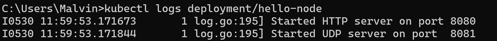
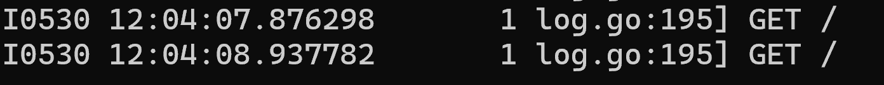
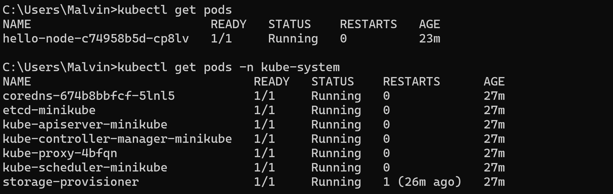

# advpro-tutorial-11
## Malvin Muhammad Raqin
**1. Perbandingan Log Sebelum dan Sesudah Pod Di-expose sebagai Service**

* **Sebelum di-expose:**
   * Sebelum saya meng-expose Pod, saya menggunakan perintah `kubectl logs deployment/hello-node` untuk memeriksa log. Pada saat itu, output hanya menampilkan pesan awal dari aplikasi:
   ```
   I0530 11:59:53.171673       1 log.go:195] Started HTTP server on port 8080
   I0530 11:59:53.171844       1 log.go:195] Started UDP server on port 8081
   ```
   * Log ini menunjukkan bahwa aplikasi sudah berjalan dan server HTTP aktif di port 8080, tetapi belum ada traffic eksternal yang mencapainya.
   


* **Setelah di-expose:**
   * Setelah saya meng-expose Pod sebagai Service menggunakan `kubectl expose deployment hello-node --type=LoadBalancer --port=8080` dan mengaksesnya melalui `minikube service hello-node`, saya membuka aplikasi di browser. Ketika saya memeriksa log lagi dengan `kubectl logs deployment/hello-node`, saya melihat entri tambahan:
   ```
   I0530 12:04:07.876298       1 log.go:195] GET /
   I0530 12:04:08.937782       1 log.go:195] GET /
   ```
   * Log baru ini menunjukkan HTTP GET request yang masuk ke aplikasi saat saya mengakses URL `http://127.0.0.1:55286` dari browser. Setiap kali saya me-refresh halaman, request baru tercatat dalam log.
   

**2. Memahami Opsi `-n` dalam `kubectl get`**

* Selama tutorial, saya menggunakan dua versi perintah `kubectl get pods`:
   * `kubectl get pods`
   * `kubectl get pods -n kube-system`

* Perintah pertama, tanpa opsi apapun, menampilkan resource di **namespace default**:
   ```
   NAME                         READY   STATUS    RESTARTS   AGE
   hello-node-c74958b5d-cp8lv   1/1     Running   0          23m
   ```
   Di sini terlihat Pod `hello-node` yang saya buat berada di namespace default.

* Perintah kedua menggunakan opsi `-n kube-system`, yang memberitahu Kubernetes untuk melihat ke dalam **namespace kube-system**:
   ```
   NAME                               READY   STATUS    RESTARTS      AGE
   coredns-674b8bbfcf-5lnl5           1/1     Running   0             27m
   etcd-minikube                      1/1     Running   0             27m
   kube-apiserver-minikube            1/1     Running   0             27m
   kube-controller-manager-minikube   1/1     Running   0             27m
   kube-proxy-4bfqn                   1/1     Running   0             27m
   kube-scheduler-minikube            1/1     Running   0             27m
   storage-provisioner                1/1     Running   1 (26m ago)   27m
   ```
   Namespace ini berisi komponen-komponen sistem dari cluster Kubernetes seperti CoreDNS, etcd, kube-apiserver, kube-controller-manager, kube-proxy, kube-scheduler, dan storage-provisioner.

* Ketika saya menjalankan `kubectl get pods -n kube-system`, saya tidak melihat Pod `hello-node` karena Pod tersebut tidak dibuat di namespace `kube-system` melainkan di namespace `default`. Ini membantu saya memahami bagaimana namespace di Kubernetes digunakan untuk memisahkan dan mengorganisir resource. Setiap namespace bertindak seperti cluster virtual di dalam cluster Kubernetes, dan penting untuk mengetahui namespace mana yang sedang kita gunakan.



