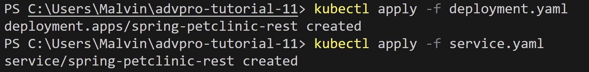

# advpro-tutorial-11
## Malvin Muhammad Raqin
**1. Perbandingan Log Sebelum dan Sesudah Pod Di-expose sebagai Service**

* **Sebelum di-expose:**
   * Sebelum saya meng-expose Pod, saya menggunakan perintah `kubectl logs deployment/hello-node` untuk memeriksa log. Pada saat itu, output hanya menampilkan pesan awal dari aplikasi:
   ```
   I0530 11:59:53.171673       1 log.go:195] Started HTTP server on port 8080
   I0530 11:59:53.171844       1 log.go:195] Started UDP server on port 8081
   ```
   * Log ini menunjukkan bahwa aplikasi sudah berjalan dan server HTTP aktif di port 8080, tetapi belum ada traffic eksternal yang mencapainya.
   


* **Setelah di-expose:**
   * Setelah saya meng-expose Pod sebagai Service menggunakan `kubectl expose deployment hello-node --type=LoadBalancer --port=8080` dan mengaksesnya melalui `minikube service hello-node`, saya membuka aplikasi di browser. Ketika saya memeriksa log lagi dengan `kubectl logs deployment/hello-node`, saya melihat entri tambahan:
   ```
   I0530 12:04:07.876298       1 log.go:195] GET /
   I0530 12:04:08.937782       1 log.go:195] GET /
   ```
   * Log baru ini menunjukkan HTTP GET request yang masuk ke aplikasi saat saya mengakses URL `http://127.0.0.1:55286` dari browser. Setiap kali saya me-refresh halaman, request baru tercatat dalam log.
   

**2. Memahami Opsi `-n` dalam `kubectl get`**

* Selama tutorial, saya menggunakan dua versi perintah `kubectl get pods`:
   * `kubectl get pods`
   * `kubectl get pods -n kube-system`

* Perintah pertama, tanpa opsi apapun, menampilkan resource di **namespace default**:
   ```
   NAME                         READY   STATUS    RESTARTS   AGE
   hello-node-c74958b5d-cp8lv   1/1     Running   0          23m
   ```
   Di sini terlihat Pod `hello-node` yang saya buat berada di namespace default.

* Perintah kedua menggunakan opsi `-n kube-system`, yang memberitahu Kubernetes untuk melihat ke dalam **namespace kube-system**:
   ```
   NAME                               READY   STATUS    RESTARTS      AGE
   coredns-674b8bbfcf-5lnl5           1/1     Running   0             27m
   etcd-minikube                      1/1     Running   0             27m
   kube-apiserver-minikube            1/1     Running   0             27m
   kube-controller-manager-minikube   1/1     Running   0             27m
   kube-proxy-4bfqn                   1/1     Running   0             27m
   kube-scheduler-minikube            1/1     Running   0             27m
   storage-provisioner                1/1     Running   1 (26m ago)   27m
   ```
   Namespace ini berisi komponen-komponen sistem dari cluster Kubernetes seperti CoreDNS, etcd, kube-apiserver, kube-controller-manager, kube-proxy, kube-scheduler, dan storage-provisioner.

* Ketika saya menjalankan `kubectl get pods -n kube-system`, saya tidak melihat Pod `hello-node` karena Pod tersebut tidak dibuat di namespace `kube-system` melainkan di namespace `default`. Ini membantu saya memahami bagaimana namespace di Kubernetes digunakan untuk memisahkan dan mengorganisir resource. Setiap namespace bertindak seperti cluster virtual di dalam cluster Kubernetes, dan penting untuk mengetahui namespace mana yang sedang kita gunakan.


### **Rolling Update & Kubernetes Manifest File**

#### **1. Perbedaan antara Rolling Update dan Recreate deployment strategy**
* Perbedaan utama antara strategi deployment **Rolling Update** dan **Recreate** terletak pada bagaimana keduanya menangani ketersediaan aplikasi selama proses update.
* Dengan strategi **Recreate**, semua Pod yang ada dari versi lama **dihentikan terlebih dahulu** sebelum Pod baru dibuat. Hal ini menyebabkan **downtime sementara** karena ada jeda di mana tidak ada instance aplikasi yang berjalan.
* Sebaliknya, strategi **Rolling Update** memastikan **zero downtime** dengan mengganti Pod lama secara bertahap dengan yang baru. Pod baru dibuat dan siap sebelum Pod lama dihentikan, yang berarti aplikasi tetap dapat diakses sepanjang proses update.

#### **2. Menggunakan Update Image dan Rollback pada Spring Petclinic REST**
* Dari pengalaman saya dengan deployment **Spring Petclinic REST** di cluster Minikube, saya melakukan beberapa operasi penting:
* Pertama, saya melakukan update image dari versi 3.0.2 ke 3.2.1 menggunakan `kubectl set image deployments/spring-petclinic-rest spring-petclinic-rest=docker.io/springcommunity/spring-petclinic-rest:3.2.1`. Proses ini berjalan lancar dengan rolling update yang dapat dilihat melalui `kubectl rollout status`.
* Kemudian saya mencoba update ke versi 4.0, namun mengalami masalah karena image dengan tag tersebut tidak tersedia di registry (manifest unknown error). Pods gagal start dengan status `ErrImagePull`.
* Untuk mengatasi masalah ini, saya menggunakan `kubectl rollout undo deployments/spring-petclinic-rest` yang berhasil mengembalikan deployment ke versi sebelumnya (3.2.1) dan semua Pod kembali berjalan normal.



#### **3. Export dan Re-deploy menggunakan Manifest File**
* Untuk memahami konsep Infrastructure as Code, saya mengexport konfigurasi deployment dan service yang sudah berjalan menggunakan:
```cmd
kubectl get deployments/spring-petclinic-rest -o yaml > deployment.yaml
kubectl get services/spring-petclinic-rest -o yaml > service.yaml
```
* Setelah itu saya menghapus cluster dengan `minikube delete` dan membuat cluster baru dengan `minikube start`.
* Dengan menggunakan manifest file yang sudah diexport, saya dapat mendeploy ulang aplikasi dengan mudah:
```cmd
kubectl apply -f deployment.yaml
kubectl apply -f service.yaml
```

#### **4. Keuntungan menggunakan Kubernetes Manifest File**
* Dari pengalaman saya, menggunakan Kubernetes manifest file memiliki keuntungan yang signifikan. Hal ini membantu mengurangi kemungkinan membuat kesalahan manual selama deployment karena semua konfigurasi ditulis secara eksplisit dalam file YAML.
* Ketika mendeploy aplikasi secara manual menggunakan perintah kubectl individual, saya harus mengingat opsi dan parameter yang tepat setiap kali, yang rawan kesalahan dan memakan waktu. Sebaliknya, menerapkan manifest file menggunakan `kubectl apply -f` jauh lebih efisien dan dapat diulang.
* Proses ini membuat deployment lebih bersih, dapat dikontrol versinya, dan lebih mudah dipelihara—terutama dalam lingkungan tim. Manifest file juga memungkinkan backup konfigurasi yang mudah dan memungkinkan recreate environment yang identik kapan saja diperlukan.

